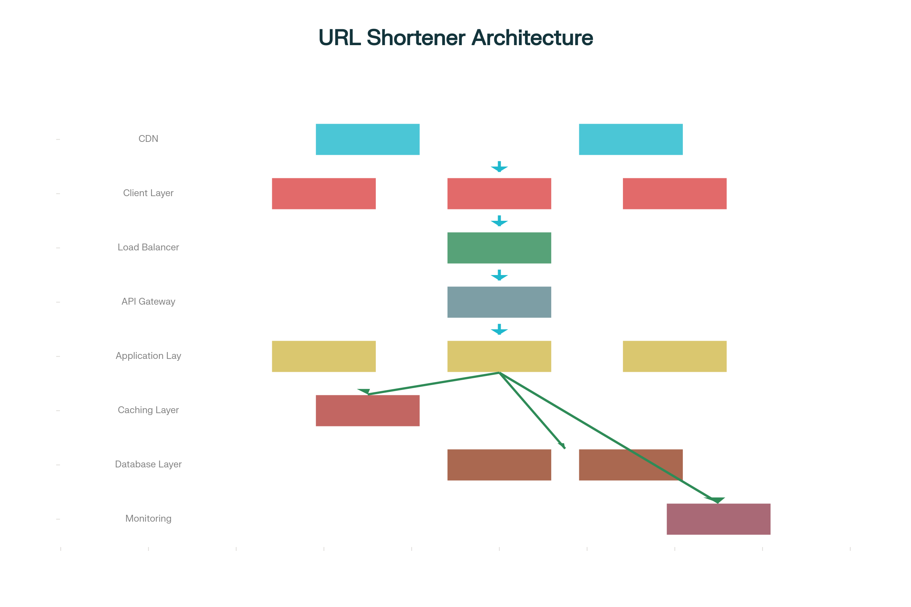

# URL Shortener Service

A production-style URL shortener backend built with Node.js, Express, PostgreSQL, Redis, and BullMQ.

## Problem Statement

Build a URL shortener that is fast on read-heavy traffic, resilient under bursty usage, and engineered with clean separation of concerns so it can scale safely.

## Architecture



## Tech Stack

- Node.js + Express
- PostgreSQL (persistent storage)
- Redis (cache, rate limiting, queue backend)
- BullMQ (asynchronous analytics ingestion)
- Pino + pino-http (logging)
- ESLint + Prettier
- Docker Compose (local infra)

## Project Structure

```text
src/
  config/        # env, logger, postgres, redis, bullmq
  controllers/   # HTTP handlers
  middleware/    # error and not-found handlers
  models/        # DB access layer
  queues/        # BullMQ producers
  routes/        # API route definitions
  services/      # business logic
  workers/       # BullMQ consumers
  utils/         # helpers (base62, async handler, HTTP error, geo)
```

## Features Implemented

- `POST /api/shorten` to create short URLs
- `GET /:shortCode` redirect endpoint
- Optional custom alias (`customAlias`)
- Optional expiry (`expiry`)
- Cache-first redirect lookup using Redis
- Redis-based per-IP rate limiting with `429`
- Queue-based analytics ingestion (`BullMQ`)
- Analytics worker with retries/exponential backoff
- Optional geo enrichment from request headers
- `GET /api/analytics/:shortCode` metrics endpoint
- `/api/health` and `/api/health/deep` endpoints

## Local Setup

1. Install dependencies:

```bash
npm install
```

2. Copy environment file:

```bash
cp .env.example .env
```

On Windows PowerShell:

```powershell
Copy-Item .env.example .env
```

3. Start PostgreSQL and Redis:

```bash
docker compose up -d
```

4. Start API server:

```bash
npm run dev
```

5. Start analytics worker (separate terminal):

```bash
npm run dev:worker
```

## Environment Variables

Required core variables:

- `APP_NAME`
- `NODE_ENV`
- `PORT`
- `CORS_ORIGIN`
- `POSTGRES_HOST`
- `POSTGRES_PORT`
- `POSTGRES_USER`
- `POSTGRES_PASSWORD`
- `POSTGRES_DB`
- `POSTGRES_SSL`
- `REDIS_HOST`
- `REDIS_PORT`
- `REDIS_PASSWORD`
- `REDIS_DB`

Rate limit settings:

- `RATE_LIMIT_ENABLED`
- `RATE_LIMIT_REQUESTS_PER_MINUTE`
- `RATE_LIMIT_WINDOW_SECONDS`

BullMQ analytics settings:

- `ANALYTICS_QUEUE_NAME`
- `ANALYTICS_QUEUE_ATTEMPTS`
- `ANALYTICS_QUEUE_BACKOFF_MS`
- `ANALYTICS_WORKER_CONCURRENCY`
- `ANALYTICS_QUEUE_REMOVE_ON_COMPLETE`
- `ANALYTICS_QUEUE_REMOVE_ON_FAIL`

Optional:

- `REDIS_CACHE_TTL_SECONDS` (default `3600`)
- `LOG_LEVEL`

## API Quick Start

### Create short URL

`POST /api/shorten`

```json
{
  "url": "https://example.com/some/long/path",
  "customAlias": "my-link",
  "expiry": "2026-12-31T23:59:59.000Z"
}
```

### Redirect

`GET /:shortCode`

```bash
curl -i http://localhost:4000/b
```

### Analytics

`GET /api/analytics/:shortCode`

```bash
curl http://localhost:4000/api/analytics/b
```

## Available Scripts

- `npm start` - run API server
- `npm run start:worker` - run analytics worker
- `npm run dev` - run API server with nodemon
- `npm run dev:worker` - run worker with nodemon
- `npm run lint` - lint source files
- `npm test` - run Jest + Supertest tests
- `npm run load:test` - generate load-test evidence

## Testing Coverage

- Shorten endpoint behavior
- Redirect behavior and analytics enqueue invocation
- Analytics endpoint behavior
- Geo extraction helper
- Queue payload normalization/idempotent job id generation
- Worker job processing path

## Performance Metrics

Latest load evidence generated via `npm run load:test`:

- Avg requests/sec: `3241`
- P95 requests/sec: `3601`
- Latency p50/p95/p99: `8 ms / 14 ms / 16 ms`
- Non-2xx responses: `0`
- Errors: `0`

Artifacts:

- `docs/load-test-report.json`
- `docs/load-test-report.md`

## Deployment

Deployment assets:

- `Dockerfile`
- `.env.example`
- `docs/deployment.md`

Quick container run:

```bash
docker build -t url-shortener-service:latest .
docker run --rm -p 4000:4000 --env-file .env url-shortener-service:latest
```

## License

ISC
